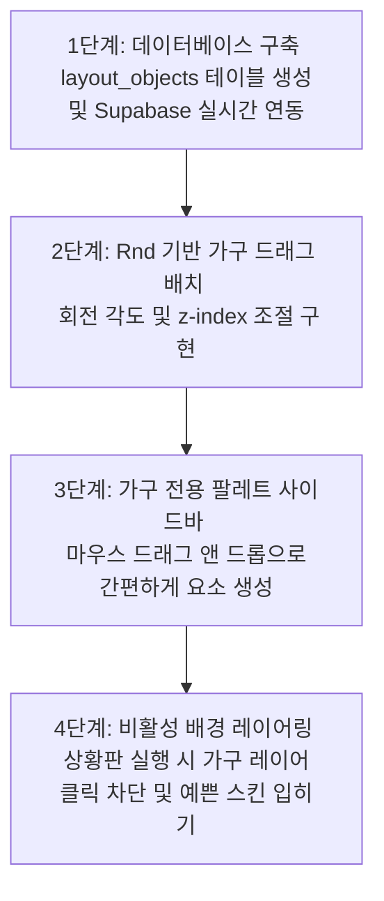

<!-- 물리치료실 상황판 내 벽면 및 가구 오브젝트 배치/편집 시스템 구축을 위한 종합 기획 및 설계 계획서입니다. -->

# 🛋️ 물리치료실 상황판 벽면 및 가구 배치 시스템 구축 계획서

실제 병원의 도면 및 물리치료실 공간 구조를 상황판에 그대로 녹여내어, 공간 인지 능력을 극대화하기 위한 **벽면(Wall) 및 가구(Furniture) 배치·편집 시스템**의 기획 및 기술 설계 계획입니다.

---

## 1. 기획 방향 및 UX 목표

- **공간의 직관성 극대화**: 일반 상황판이 단순한 격자 리스트라면, 이 시스템은 **실제 물리치료실의 도면과 100% 싱크로율**을 맞춰 접수처(안내 데스크)에서 침대, 벽면 구조, 기둥, 환자 대기 소파까지 한눈에 가독성 있게 파악할 수 있도록 돕습니다.
- **손쉬운 인테리어 편집**: 사용자가 복잡한 툴 없이 파워포인트나 도면 설계 툴을 쓰듯 마우스 드래그 몇 번으로 손쉽게 공간을 구획할 수 있게 디자인합니다.

---

## 2. 배치 가능한 구조물 및 가구 리스트

각 구조물은 치료실의 정체성을 시각적으로 뚜렷하게 구분 짓기 위해 **색감과 모서리 둥글기(Border Radius) 등을 프리미엄하게 세분화**하여 설계합니다.

| 오브젝트 분류 | 용도 및 설명 | 시각 스타일 가이드 |
| :--- | :--- | :--- |
| **벽면 (Wall)** | 치료실 외곽선 및 내부 탈의실, 도수치료실 등의 방을 구획하는 얇은 면 | 굵기 8px~12px 정도의 미니멀한 짙은 슬레이트 그레이선 (`bg-slate-300`) |
| **기둥 (Pillar)** | 도면상의 사각 기둥 및 원형 기둥 | 단단한 느낌을 주는 불투명 슬레이트 솔리드 사각형/원형 (`bg-slate-400/80`) |
| **출입구 (Door)** | 치료실 문 및 각 방의 통로 | 문이 열려 있는 각도 가이드 선이 표시되는 반투명 아이콘 스타일 |
| **안내 데스크 (Desk)** | 상황판의 중심을 잡아주는 접수 및 제어 데스크 | 모서리가 둥글게 처리된 베이지/우드톤의 불투명 라운드 박스 (`bg-amber-100/70 border-amber-200`) |
| **소파 (Sofa)** | 환자 대기 공간 및 보호자 의자 | 편안함을 주는 부드러운 네이비 또는 하늘색 계열의 둥근 모듈러 박스 (`bg-sky-50 border-sky-100`) |

---

## 3. 데이터베이스 설계 (DB Schema)

기존의 `beds` 테이블에 가구 데이터를 억지로 욱여넣지 않고, **독립적인 레이아웃 오브젝트 테이블(`layout_objects`)을 신설**하여 로딩 속도와 데이터 무결성을 보장합니다.

```sql
CREATE TABLE public.layout_objects (
    id TEXT PRIMARY KEY,                       -- 고유 오브젝트 ID (예: 'wall-123')
    object_type TEXT NOT NULL,                -- 'WALL', 'PILLAR', 'DOOR', 'DESK', 'SOFA' 등
    name TEXT,                                -- 기입하고 싶은 라벨명 (예: "안내데스크 1")
    x_pos INTEGER NOT NULL DEFAULT 0,         -- X 좌표
    y_pos INTEGER NOT NULL DEFAULT 0,         -- Y 좌표
    width INTEGER NOT NULL DEFAULT 100,       -- 가로 너비
    height INTEGER NOT NULL DEFAULT 100,      -- 세로 높이
    rotation INTEGER NOT NULL DEFAULT 0,      -- 회전 각도 (0, 90, 180, 270도 또는 자유 회전)
    z_index INTEGER NOT NULL DEFAULT 10,       -- 겹침 순서 (벽이 가구 아래로 가게 제어)
    created_at TIMESTAMP WITH TIME ZONE DEFAULT now() NOT NULL
);
```

---

## 4. 프론트엔드 편집 워크플로우 (UI/UX)

배치 편집 모드 진입 시 작동하는 가구 인테리어용 특화 편집 프로세스입니다.

### STEP 1. 배치 편집 모드 진입
- 상황판 우측 상단 `[배치 편집]`을 누르면 가구와 침대를 편집할 수 있는 설계 화면으로 전환됩니다.

### STEP 2. 가구 서랍장(Palette Sidebar) 등장
- 화면 좌측이나 우측에 **"구조물 & 가구 모음"** 슬라이드 사이드바가 부드럽게 열립니다.
- 이곳에서 벽, 기둥, 문, 데스크, 소파의 예쁜 썸네일 아이콘을 볼 수 있습니다.

### STEP 3. 끌어다 놓기 (Drag & Drop) 및 조절
- 사이드바에서 배치하고 싶은 구조물을 상황판 도면(Canvas) 위로 **마우스로 드래그 앤 드롭**하여 생성합니다.
- 배치된 가구를 클릭하면 일반 침대 카드 편집과 똑같이 **모서리 핸들을 조절해 세로로 길게 늘려 벽을 만들거나, 가로로 뚱뚱하게 만들어 접수대 크기를 맞출 수 있습니다.**
- **회전 기능(Rotation)**: 오브젝트 상단에 회전용 원형 핸들을 제공하여 비스듬한 도면이나 꺾여 있는 벽면 구조도 자유롭게 맞출 수 있도록 각도(Rotation) 수정을 지원합니다.

### STEP 4. 가구 툴팁 컨트롤러
- 가구를 선택하면 머리 위에 다음과 같은 컨트롤러 툴팁이 뜹니다.
  - **장비명/라벨 변경**: 안내 데스크 등 텍스트 기입이 필요할 때 직접 입력
  - **순서 변경 (z-index)**: "맨 앞으로 보내기" / "맨 뒤로 보내기"
  - **복제 버튼**: 여러 개의 벽이나 소파를 만들 때 한 번에 동일 크기로 복제
  - **삭제 버튼 (쓰레기통)**: 불필요해진 가구 영구 삭제

### STEP 5. 배치 저장 및 일반 모드 고정
- `[배치 저장]`을 누르면 `layout_objects` 테이블에 정보가 동기화 저장됩니다.
- 일반 상황판 모드로 돌아오면, 모든 벽과 가구는 **비활성 배경 레이어**로 작동합니다. 즉, 마우스 클릭이나 드래그가 원천 차단되어 실제 환자 배정 및 치료 현황 상황판을 조작할 때 가구가 방해되지 않고 오직 침상만 컨트롤할 수 있습니다.

---

## 5. 단계별 개발 로드맵

개발에 돌입하게 되면 다음과 같은 정교한 순서로 설계가 진행됩니다.


